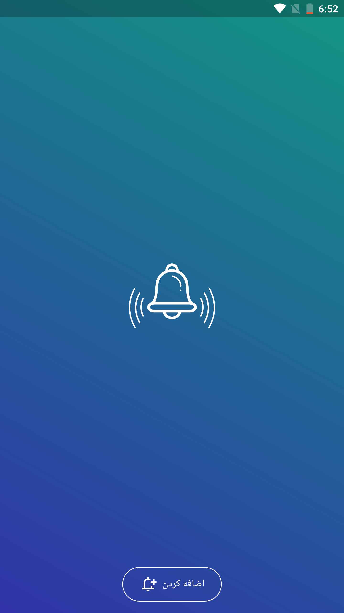
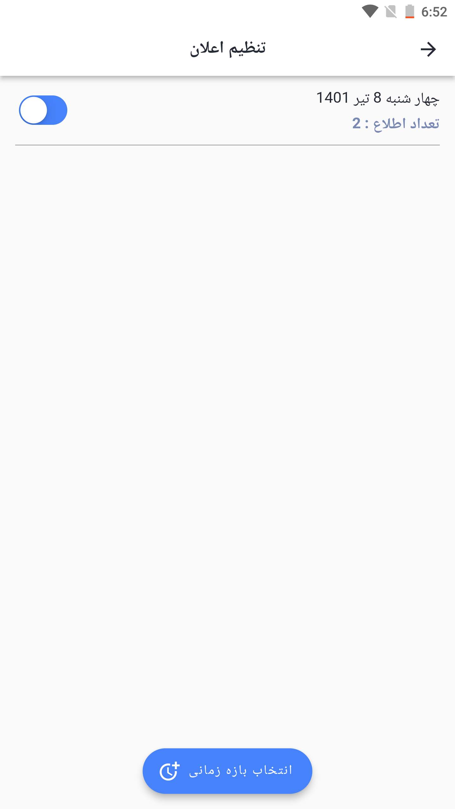
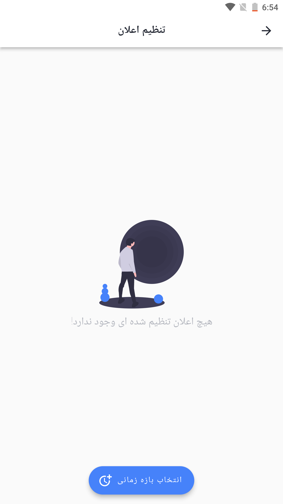
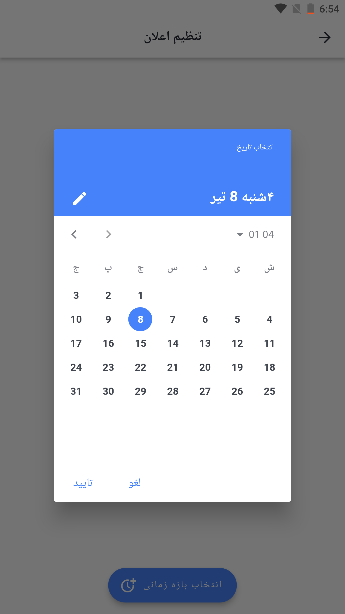
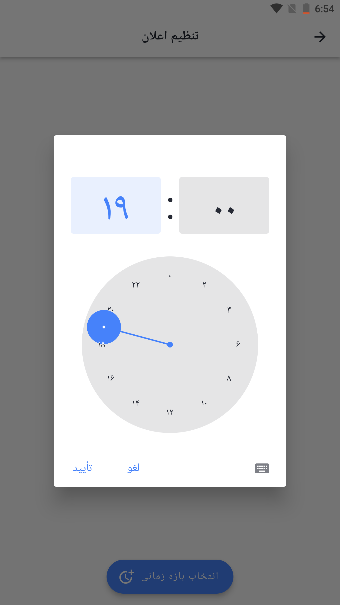
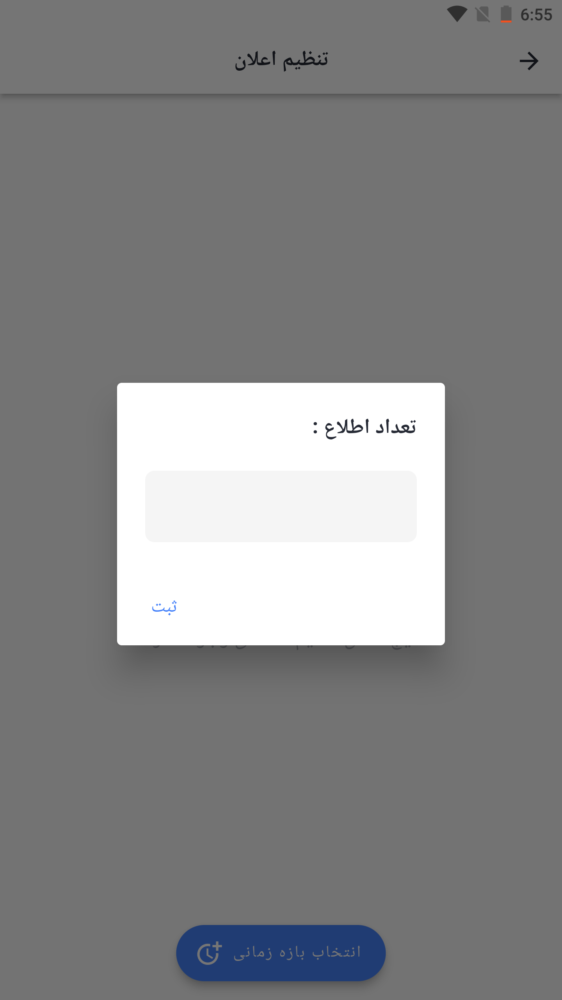

## Notify Me | Flutter

A Flutter app to notify the user at random times.

Takes Date and time period and number of notifications from the user
And randomly create the notification time and timing required to display the notification

Technologies

Technologies and Tools that are used in this projects are:

    Flutter
    Flutter Bloc
    Dependency Injection
    MVVM Arcitecture
    Local Notification
    Alarm Manager

## Screenshot

<table border>
    <tr>
        <th style="text-align:center">Main Screen</th>
        <th style="text-align:center">Set Notify Screen</th>
        <th style="text-align:center">Empty Screen</th>
        <th style="text-align:center">Select Date</th>
    </tr>
    <tr>
        <td></td>
        <td></td>
        <td></td>
        <td></td>
    <tr>
</table>

<table border>
    <tr>
        <th style="text-align:center">Select time</th>
        <th style="text-align:center">Enter Count</th>
    </tr>
    <tr>
        <td></td>
        <td></td>
    <tr>
</table>

